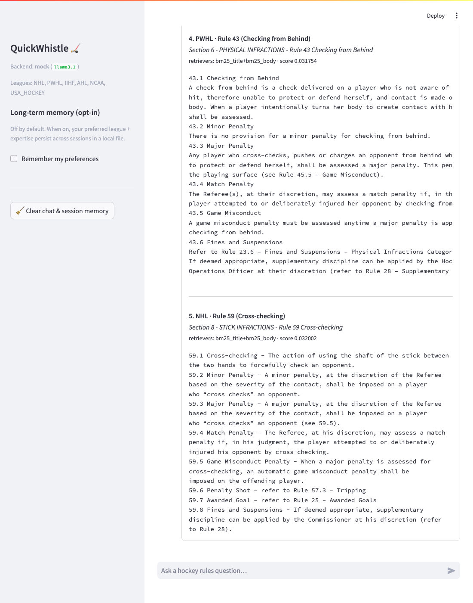
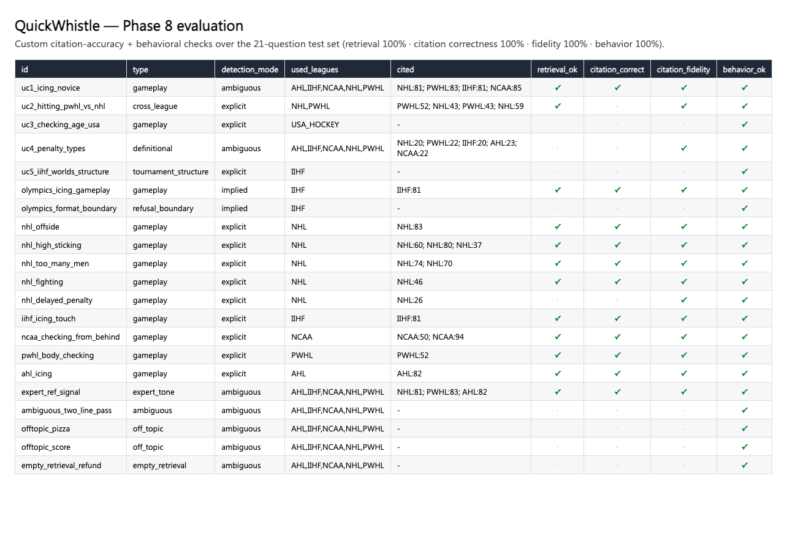

# QuickWhistle 🏒

A multi-source **RAG chatbot** that answers ice-hockey **rules** questions across six
rulebooks — **NHL, PWHL, IIHF, AHL, NCAA, and USA Hockey**. Every answer is grounded
in retrieved rulebook text, written in plain language by default, and **cited** by
rulebook + rule number. When leagues diverge, QuickWhistle presents the differences
side-by-side.

Built for INFO 7375. The pipeline is modular so each piece (ingestion, retrieval,
memory, tools, UI, eval) maps to a separate assignment write-up.

> ⚠️ The rulebook PDFs are copyrighted and are **not** committed to this repo.
> Place your own copies in `data/raw/` (see [Data](#data)).



---

## Quick demo (one command)

After setup (below), with the index already built, run the chatbot — **no API
key or quota needed** thanks to the offline stub backend:

```bash
# macOS / Linux
MODEL_PROVIDER=mock streamlit run app.py
```
```powershell
# Windows (PowerShell)
$env:MODEL_PROVIDER="mock"; streamlit run app.py
```

For real generated answers, set `MODEL_PROVIDER=gemini` (or `ollama`) in `.env`
and just `streamlit run app.py`. To rebuild everything from scratch:

```bash
python src/ingest.py --all && python src/build_index.py --all && streamlit run app.py
```

---

## Architecture

```
rulebook PDFs (6 leagues)  ──▶  ingest.py       extract + structure-aware chunks ──▶ data/chunks/{league}.jsonl
                                build_index.py  embed (BGE) ──▶ per-league Chroma collections + BM25 index
user question ─▶ retrieve.py   detect league ─▶ hybrid search (BM25 + dense, RRF) ─▶ metadata filter ─▶ top-k
                answer.py      system prompt + retrieved context ─▶ LLM ─▶ grounded, cited answer
                memory.py      session memory (last topic/league) + opt-in long-term store
                app.py         Streamlit chat UI (answer + Sources + "view retrieved chunks")
                eval.py        RAGAS + custom citation-accuracy on a test set
                tools.py       metric↔imperial converter via tool calling
```

## Tech stack (locked)

| Layer | Tool |
|---|---|
| Language | Python 3.11+ |
| PDF extraction | PyMuPDF (`fitz`), `pdfplumber`, `pytesseract` (OCR fallback) |
| Orchestration | LlamaIndex (light) |
| Embeddings | `sentence-transformers` — `BAAI/bge-small-en-v1.5` (local, free) |
| Vector store | Chroma (local, persistent), one collection per league |
| Retrieval | Hybrid: BM25 (`rank_bm25`) + dense (Chroma), fused via reciprocal rank fusion |
| Generation LLM | Swappable via one config value: **Gemini** (default), local **Ollama**, or an offline **mock** stub |
| Evaluation | RAGAS + custom citation-accuracy check |
| UI | Streamlit |
| Config/secrets | python-dotenv (`.env`) |

---

## Setup

QuickWhistle runs locally and free by default (local embeddings + local vector DB).
The only external call is the generation LLM, and that is swappable.

### 1. Clone and create a virtual environment

**macOS (Apple Silicon / M1):**
```bash
git clone <your-repo-url>
cd quickwhistle
python3.11 -m venv .venv
source .venv/bin/activate
pip install --upgrade pip
pip install -r requirements.txt
```

**Windows (PowerShell):**
```powershell
git clone <your-repo-url>
cd quickwhistle
py -3.11 -m venv .venv
.\.venv\Scripts\Activate.ps1
pip install --upgrade pip
pip install -r requirements.txt
```

### 2. Configure secrets

```bash
cp .env.example .env        # macOS/Linux
copy .env.example .env      # Windows
```

Then edit `.env` and choose your generation model (see below).

### 3. (Optional) OCR fallback — Tesseract

Only needed if a PDF page has no extractable text. PyMuPDF handles most pages.

- **macOS:** `brew install tesseract`
- **Windows:** install from <https://github.com/UB-Mannheim/tesseract/wiki> and add it to `PATH`.

---

## Switching the generation model (Gemini / Ollama / mock)

The backend is **one config value** (`MODEL_PROVIDER`) in `.env`. No code changes.

### Option A — Gemini (default, free tier)
```dotenv
MODEL_PROVIDER=gemini
GEMINI_API_KEY=your_api_key_here
GEMINI_MODEL=gemini-2.5-flash-lite
```
Get a free key at <https://aistudio.google.com/app/apikey>.

> **Model note:** the brief's `gemini-1.5-flash` was **retired** by Google. The
> current free/fast equivalents are `gemini-2.5-flash` / `gemini-2.5-flash-lite`
> — set whichever your key has quota for.
>
> **⚠️ Free-tier daily quota:** a free Gemini key is capped at roughly
> **20 requests/day *per model*** (plus ~5/min). That's fine for interactive
> chat, but a full 21-question eval or a RAGAS subset will exhaust it. Mitigations
> built in: requests are spaced + retried, and `src/eval.py` **caches and resumes**
> so you can finish across days or rotate models (each model has its own daily
> bucket). For heavy/offline runs, use Ollama.

### Option B — Ollama (fully local, no API key, no quota)
```dotenv
MODEL_PROVIDER=ollama
OLLAMA_MODEL=llama3.1
OLLAMA_HOST=http://localhost:11434
```
Install Ollama from <https://ollama.com>, then `ollama pull llama3.1`.
Best choice for the **full RAGAS run** (quota-free).

### Option C — mock (offline stub, no model at all)
```dotenv
MODEL_PROVIDER=mock
```
Runs the entire retrieve → ground → render pipeline with a deterministic
placeholder answer (real retrieval + citations, no LLM). Ideal for demos, UI
work, and CI without spending any quota.

---

## Data

The six official rulebook PDFs are copyrighted and **gitignored**. Put your copies in
`data/raw/` using the filenames mapped in [config.py](config.py) (`RAW_PDF_FILES`) —
rename either the files or the config entries to match. The build was developed
against the **2025–26 editions** (NHL, PWHL, IIHF, AHL, NCAA) and the
**2025–29 USA Hockey Playing Rules**.

> **⚠️ USA Hockey edition caveat:** the USA Hockey source is the **Junior**
> playing-rules edition. It does **not** contain the youth body-checking
> *age-progression* (which lives in USA Hockey's youth rules). So a question like
> *"At what age is body checking allowed?"* correctly yields a **graceful
> limitation/refusal** rather than a fabricated age — verified in the eval. Swap
> in the full youth rulebook if you need that content.

---

## Usage

Build the index once (ingest → embed), then run the UI. Re-running ingest/index
is idempotent and skips work that's already done.

```bash
python src/ingest.py --all     # PDFs  -> data/chunks/{league}.jsonl   (Phase 2)
python src/build_index.py --all  # chunks -> Chroma + BM25             (Phase 3)
streamlit run app.py           # chat UI                               (Phase 7)
python src/eval.py             # metrics table -> tests/eval_results.csv (Phase 8)
```

### Chat UI (Phase 7)

```bash
streamlit run app.py                       # uses MODEL_PROVIDER from .env
MODEL_PROVIDER=mock streamlit run app.py   # offline stub, no API key/quota
```

On **Windows**, set the stub backend with PowerShell instead:
```powershell
$env:MODEL_PROVIDER="mock"; streamlit run app.py
```

The UI gives you chat history, the grounded + cited answer, a **🔎 view retrieved
chunks** expander (each chunk's league + rule number + section), and a small
caption showing which league(s) were detected and how. The sidebar has the
**opt-in long-term memory** controls (preferred league + expertise, with a delete
button) and a clear-chat button. Free-tier latency shows a "thinking…" spinner,
and the app spaces requests + retries on rate limits.

### Evaluation (Phase 8)

```bash
python src/eval.py                       # custom citation-accuracy + behavior table -> tests/eval_results.csv
python src/eval.py --ragas --ragas-limit 6   # + RAGAS (faithfulness/relevancy/recall); needs quota or Ollama
```
Answers are cached to `tests/eval_run.jsonl` and the run resumes, so a daily
quota cap doesn't lose progress.

### Unit-converter tool (Phase 9 / HW4)

```bash
python src/tools.py            # offline converter self-checks (no LLM)
python src/tools.py --live     # live tool-calling demo via Gemini
```
`convert_units` (metric↔imperial for length/mass) is exposed to the model via
Gemini function calling, so e.g. *"How wide is an IIHF rink in feet?"* makes the
model call the tool (26–30 m → 85.30–98.43 ft) rather than doing the arithmetic.

### Tests / smoke check

```bash
MODEL_PROVIDER=mock python tests/smoke_test.py   # end-to-end multi-turn chat (no quota)
python tests/check_memory.py                     # session + long-term memory checks
python tests/make_screenshots.py                 # regenerate docs/screenshots (needs playwright)
```

---

## Screenshots

| Live conversation (memory carry-forward + chunk expander) | Phase 8 eval table |
|---|---|
|  |  |

Generated headlessly on the `mock` backend via `tests/make_screenshots.py`
(install the optional `playwright` extra + `python -m playwright install chromium`).

---

## Troubleshooting

- **"Cannot copy out of meta tensor" on first query in the UI** — Streamlit's
  module file-watcher can interrupt the embedding model's load. This repo ships
  `.streamlit/config.toml` with `fileWatcherType = "none"` to prevent it. If you
  removed that file, re-add it or launch with
  `STREAMLIT_SERVER_FILE_WATCHER_TYPE=none streamlit run app.py`.
- **Gemini `404 ... is not found`** — the model name was retired; set a current
  one (e.g. `gemini-2.5-flash-lite`) in `.env`.
- **Gemini `429 RESOURCE_EXHAUSTED`** — daily/per-minute free quota hit; wait for
  reset, switch `GEMINI_MODEL` (separate bucket), or use `MODEL_PROVIDER=ollama`.

---

## Project layout

```
quickwhistle/
  README.md   requirements.txt   .env.example   config.py   .gitignore
  .streamlit/config.toml                  # disables torch-breaking file watcher
  data/   raw/  chunks/  chroma/  user_memory/
  prompts/   system_prompt.txt            # used verbatim
  src/   ingest.py  build_index.py  retrieve.py  answer.py  memory.py  eval.py  tools.py
  app.py                                  # Streamlit chat UI
  tests/ test_set.jsonl  eval_results.csv  run_acceptance.py
         check_memory.py  smoke_test.py   make_screenshots.py
  docs/screenshots/  conversation.png  eval_table.png
```

## License / academic note

Course project for INFO 7375. Rulebook content remains the property of the respective
leagues and is not redistributed here.
